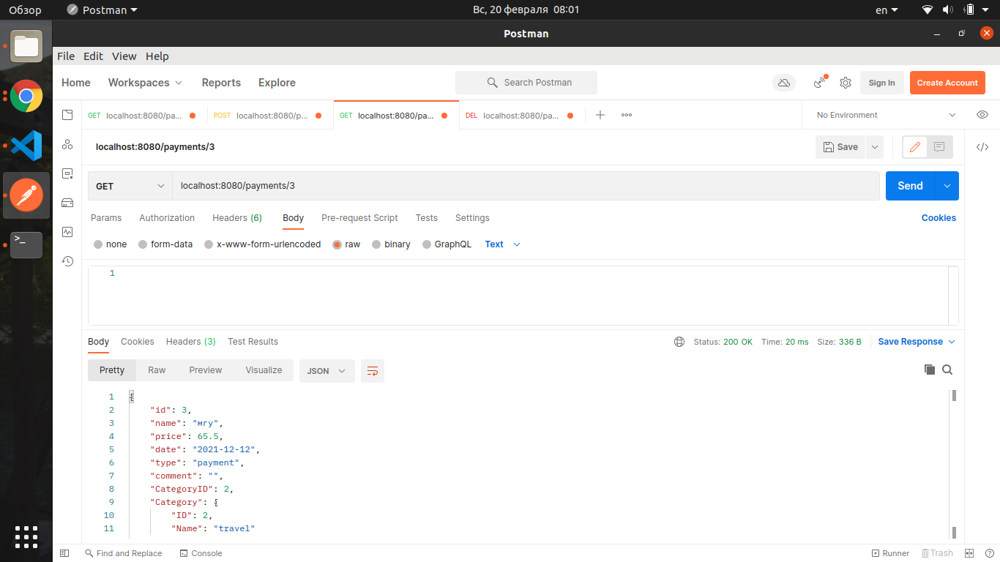

# Финансовая грамотность

## Описание задания:


Разработать go API "Финансовая грамотностсь" 

по движению денежных средств и текущему финансовосу состоянию.


                                    
## Реализовано:

+ Стуктура Базы Данных (PostgreSQL):
  + Категории (справочник)
  + Платежи (Доход или расход)

+ Функции
  + Управление платежами (CRUD)
  + Управление категориями (CRUD)

## Пример работы:

Запускаем приложение командой:

```
go run main.go
```

### Протестируем функцию getPaymentsBYID:

Отправляем GET запрос на локальный хост (я это делаю через POSTMAN) localhost:8080/payments/3

Уже созданной заранее нами базе по id = 3 лежит:

```
{
    "id": 3,
    "name": "мгу",
    "price": 65.5,
    "date": "2021-12-12",
    "type": "payment",
    "comment": "",
    "CategoryID": 2,
    "Category": {
        "ID": 2,
        "Name": "travel"
    }
}
```

Соответственно, после нашего запроса по id = 3 должен вернуться результат с телом вышеуказонного сегмента.

### Получаемый результат:



Аналогично с остальными запросами.
